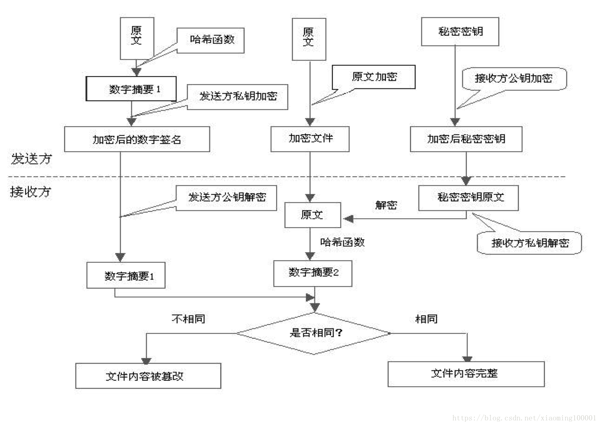

# 每天一个知识点

## 1.RPC和HTTP请求区别？

**RPC:**

IPC (进程间通信) ，是在多任务操作系统或联网的计算机之间运行的程序和进程所用的通信技术。有两种类型的进程间通信（IPC）。
LPC(本地过程调用)，LPC用在多任务操作系统中，使得同时运行的任务能互相会话。这些任务共享内存空间使任务同步和互相发送信息。
RPC类似于LPC，只是在网上工作。

RPC，即 Remote Procedure Call（远程过程调用），是一个计算机**通信协议**。 其调用协议通常包含**传输协议**和**序列化协议**。该协议允许运行于一台计算机的程序调用另一台计算机的子程序，而程序员无需额外地为这个交互作用编程。说得通俗一点就是：A计算机提供一个服务，B计算机可以像调用本地服务那样调用A计算机的服务。

**RPC按传输协议:** 可以分为基于HTTP的、基于TCP等。如著名的 [gRPC](grpc / grpc.io) 使用的 http2 协议，也有如dubbo一类的自定义报文的tcp协议。

**RPC按报文协议:** 可以分为基于XML文本的、基于JSON文本的，二进制的。

**RPC按是否跨平台语言:**可以分为平台专用的，平台中立的。

**补充**: **WebService一般属于基于HTTP的、XML文本的、跨平台（平台中立）的RPC协议。功能完善、体系成熟、支持事务、支持安全机制，广泛应用在金融电信（中国电信一个省级分公司就有几千个WS），传统企业的业务系统，ESB/SOA体系等。缺点：过于复杂，性能不是最优的，互联网用的较少。**

**HTTP:**

超文本传输协议，是一个基于请求与响应，无状态的，应用层的协议，常基于TCP/IP协议传输数据，互联网上应用最为广泛的一种网络协议,所有的WWW文件都必须遵守这个标准。设计HTTP的初衷是为了提供一种发布和接收HTML页面的方法。

**HTTP和RPC的选用:**

速度来看，RPC要比http更快，虽然底层都是TCP，但是http协议的信息往往比较臃肿。所谓的效率优势是针对http1.1协议来讲的，http2.0协议已经优化编码效率问题，像grpc这种rpc库使用的就是http2.0协议。http容器的性能测试单位通常是kqps，自定义tpc协议则通常是10kqps到100kqps。

难度来看，RPC实现较为复杂，http相对比较简单。RPC需要满足像调用本地服务一样调用远程服务，也就是对调用过程在API层面进行封装。Http协议没有这样的要求，因此请求、响应等细节需要我们自己去实现。

- 优点：RPC方式更加透明，对用户更方便。Http方式更灵活，没有规定API和语言，跨语言、跨平台
- 缺点：RPC方式需要在API层面进行封装，限制了开发的语言环境。调用端和服务端需要使用相同的技术，要么都hessian，要么都dubbo。

**总结:成熟的rpc库相对http容器，更多的是封装了“服务发现”，"负载均衡"，“熔断降级”一类面向服务的高级特性。可以这么理解，rpc框架是面向服务的更高级的封装。如果把一个http servlet容器上封装一层服务发现和函数代理调用，那它就已经可以做一个rpc框架了。**


## 2.cookie、session和token的区别?

**关于session:**
用户登录网页时会给服务器发送请求，带着用户信息，此时服务器会进行判断并返回session给用户

1.服务器获取用户信息。
2.判断验证用户。
3.判断成功，将用户信息写入redis并得到sessionid。
4.将session写入cookie返回给前端发送给用户。
5.用户拿着session去请求服务器，服务器解析session后判断用户信息并成功访问。

**session的缺点：**
1.因为用户信息是保存在**服务端**的**内存中的**，随着用户量增大，所需要的内存资源也随之增大，不可避免的造成内存溢出。
2.因为session是基于cookie来进行用户识别的，所以如果cookie会被黑客截获进行CSRF攻击，这样一来就容易被跨站攻击，用户信息被泄露，造成经济损失,虽然   可以关闭浏览器每次访问都携带cookie和session信息的功能，但是有些网站是基于session登录，这样一来就无法使用该网页。
3.随着用户量信息量增多，不可避免进行扩容，建立服务器集群。而随之而来问题就是当用户登录服务器1的时候进行下一个操作可能会被分配到服务器2，此时服务器2没有保存用户的登录信息，所以需要进行再次登录。此时造成了逻辑缺失。

**关于token**
token机制与session机制的差距不大，最主要的是服务器处理的第三步：

session： 判断成功，将用户信息写入redis并得到sessionid。
token：判断成功，将用户信息进行加密生成一个加密字符串保存在token变量中。
此时服务器返回给用户的就不是session值而是一个token值,前端接受加密字符串通过js代码保存在storage中，用户使用该token值访问网页，网页使用get方法通过js代码获取storage中的token值，并且进行解密，当解密成功获取用户信息。

token值就像一串随机字符串，就算被黑客截获也无法使用token来跨域攻击网站致使用户信息泄露，因为浏览器的同源策略致使无法使用不同浏览器登录用户；其次token值不是存在cookie中，而是随着js代码保存在storage中。

​	

## 3.== 和equals的区别?

1. **==，比较的是值是否相等。**

如果作用于基本数据类型的变量，则直接比较其存储的 值是否相等，如果作用于引用类型的变量，则比较的是所指向的对象的地址是否相等。

```
其实==比较的不管是基本数据类型，还是引用数据类型的变量，比较的都是值，只是引用类型变量存的值是对象的地址
```

2. **对于equals方法，比较的是是否是同一个对象。**

首先，equals()方法不能作用于基本数据类型的变量，

另外，equals()方法存在于Object类中，而Object类是所有类的直接或间接父类，所以说所有类中的equals()方法都继承自Object类，在没有重写equals()方法的类中，调用equals()方法其实和使用==的效果一样，也是比较的是引用类型的变量所指向的对象的地址，不过，Java提供的类中，有些类都重写了equals()方法，重写后的equals()方法一般都是比较两个对象的值，比如String类。

Object类equals()方法源码：

```
public boolean equals(Object obj) {
     return (this == obj);
}
```

- 情况 1：类没有覆盖 `equals()`方法。则通过`equals()`比较该类的两个对象时，等价于通过“==”比较这两个对象。使用的默认是 `Object`类`equals()`方法。
- 情况 2：类覆盖了 `equals()`方法。一般，我们都覆盖 `equals()`方法来两个对象的内容相等；若它们的内容相等，则返回 true(即，认为这两个对象相等)。

```java
public class test1 {
    public static void main(String[] args) {
        String a = new String("ab"); // a 为一个引用
        String b = new String("ab"); // b为另一个引用,对象的内容一样
        String aa = "ab"; // 放在常量池中
        String bb = "ab"; // 从常量池中查找
        if (aa == bb) // true
            System.out.println("aa==bb");
        if (a == b) // false，非同一对象
            System.out.println("a==b");
        if (a.equals(b)) // true
            System.out.println("aEQb");
        if (42 == 42.0) { // true
            System.out.println("true");
        }
    }
}
```

**说明：**

- `String` 中的 `equals` 方法是被重写过的，因为 `Object` 的 `equals` 方法是比较的对象的内存地址，而 `String` 的 `equals` 方法比较的是对象的值。
- 当创建 `String` 类型的对象时，虚拟机会在常量池中查找有没有已经存在的值和要创建的值相同的对象，如果有就把它赋给当前引用。如果没有就在常量池中重新创建一个 `String` 对象。

`String`类`equals()`方法：

```java
public boolean equals(Object anObject) {
    if (this == anObject) {
        return true;
    }
    if (anObject instanceof String) {
        String anotherString = (String)anObject;
        int n = value.length;
        if (n == anotherString.value.length) {
            char v1[] = value;
            char v2[] = anotherString.value;
            int i = 0;
            while (n-- != 0) {
                if (v1[i] != v2[i])
                    return false;
                i++;
            }
            return true;
        }
    }
    return false;
}
```


## 4.HTTP 和 HTTPS

### 4.1 什么是HTTP

```
超文本传输协议，是一个基于请求与响应，无状态的，应用层的协议，常基于TCP/IP协议传输数据，互联网上应用最为广泛的一种网络协议,所有的WWW文件都必须遵守这个标准。设计HTTP的初衷是为了提供一种发布和接收HTML页面的方法。
```

### 4.2 HTTP的发展史

| 版本     | 产生时间 | 内容                                                         | 发展现状           |
| -------- | -------- | ------------------------------------------------------------ | ------------------ |
| HTTP/0.9 | 1991年   | 不涉及数据包传输，规定客户端和服务器之间通信格式，只能GET请求 | 没有作为正式的标准 |
| HTTP/1.0 | 1996年   | 传输内容格式不限制，增加PUT、PATCH、HEAD、 OPTIONS、DELETE命令 | 正式作为标准       |
| HTTP/1.1 | 1997年   | 持久连接(长连接)、节约带宽、HOST域、管道机制、分块传输编码   | 2015年前使用最广泛 |
| HTTP/2   | 2015年   | 多路复用、服务器推送、头信息压缩、二进制协议等               | 逐渐覆盖市场       |

### 4.3 HTTP1.1 VS HTTP2


**多路复用**：通过单一的HTTP/2连接请求发起多重的请求-响应消息，多个请求stream共享一个TCP连接，实现**多流并行**而不是依赖建立多个TCP连接。

### 4.4 什么是HTTPS

《图解HTTP》这本书中曾提过HTTPS是身披SSL外壳的HTTP。HTTPS是一种通过计算机网络进行安全通信的传输协议，经由**HTTP进行通信**，利用SSL/TLS建立全信道，加密数据包。HTTPS使用的主要目的是**提供对网站服务器的身份认证**，同时**保护交换数据的隐私与完整性**。

PS:TLS是传输层加密协议，前身是SSL协议，由网景公司1995年发布，有时候两者不区分。

### 4.5 HTTPS的工作原理

客户端在使用HTTPS方式与Web服务器通信时有以下几个步骤，如图所示。

　　（1）客户使用https的URL访问Web服务器，要求与Web服务器建立SSL连接。

　　（2）Web服务器收到客户端请求后，会将网站的证书信息（证书中包含公钥）传送一份给客户端。

　　（3）客户端的浏览器与Web服务器开始协商SSL连接的安全等级，也就是信息加密的等级。

　　（4）客户端的浏览器根据双方同意的安全等级，建立会话密钥，然后利用网站的公钥将会话密钥加密，并传送给网站。

　　（5）Web服务器利用自己的私钥解密出会话密钥。

　　（6）Web服务器利用会话密钥加密与客户端之间的通信。

 

**补充1:对称加密和非对称加密区别：**

1、对称加密中加密和解密使用的秘钥是同一个；非对称加密中采用两个密钥，一般使用公钥进行加密，私钥进行解密。

2、对称加密解密的速度比较快，非对称加密和解密花费的时间长、速度相对较慢。

3、对称加密的安全性相对较低，非对称加密的安全性较高。

常见的对称加密算法: DES、3DES、Blowfish、IDEA、RC4、RC5、RC6 和 AES 

常见的非对称加密算法: RSA、ECC（移动设备用）、Diffie-Hellman、El Gamal、DSA（数字签名用）

Hash算法（摘要算法）

Hash算法特别的地方在于它是一种单向算法，用户可以通过hash算法对目标信息生成一段特定长度的唯一hash值，却不能通过这个hash值重新获得目标信息。因此Hash算法常用在不可还原的密码存储、信息完整性校验等。

常见的摘要算法有: MD2、MD4、MD5、HAVAL、SHA

**补充2:HTTPS=数据加密+网站认证+完整性验证+HTTP**




**补充3:加密类型有?**

**1.混合加密：**结合非对称加密和对称加密技术。客户端使用对称加密生成密钥对传输数据进行加密，然后使用非对称加密的公钥再对秘钥进行加密，所以网络上传输的数据是被秘钥加密的密文和用公钥加密后的秘密秘钥，因此即使被黑客截取，由于没有私钥，无法获取到加密明文的秘钥，便无法获取到明文数据。

**2.数字摘要：**通过单向hash函数对原文进行哈希，将需加密的明文“摘要”成一串固定长度(如128bit)的密文，不同的明文摘要成的密文其结果总是不相同，同样的明文其摘要必定一致，并且即使知道了摘要也不能反推出明文。

**3.数字签名技术：**数字签名建立在公钥加密体制基础上，是公钥加密技术的另一类应用。它把公钥加密技术和数字摘要结合起来，形成了实用的数字签名技术。
