## Linux部署

### 如何在Linux服务器部署SVN服务?

------

***环境:centos7.5,svnserve***

**1.检查是否已经安装**

```
rpm -qa | grep subversion
```

如果已经安装过会有如下显示:

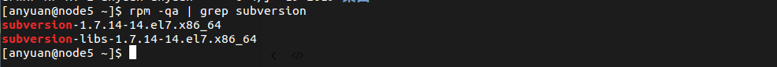

**2.通过yum命令安装svnserve**

```
yum -y install subversion
```

**3.检查是否安装成功**

```
svnserve --version
```

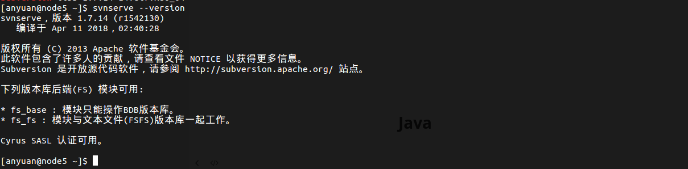

**4.创建仓库根目录**

```
mkdir -p /home/svn/svnrepos
```

mkdir ： 如果存在上级目录不存在的情况，会无法创建下级目录, 会提出ERROR

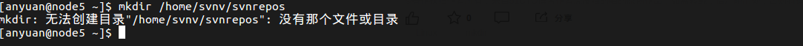

mkdir -p ：递归创建目录，即使上级目录不存在，会按目录层级自动创建目录

**5.创建一个svn仓库**

```
svnadmin create /home/svn/svnrepos/documents
```

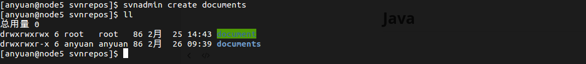

**6.查看新建好的仓库目录**

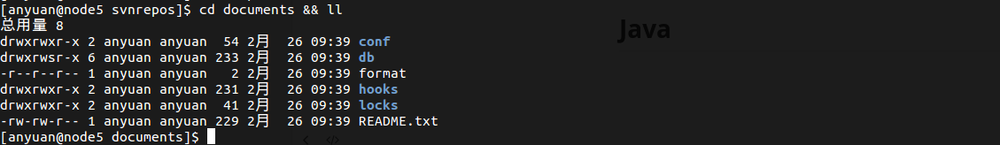

仓库目录说明:

```
hooks目录：放置hook脚步文件的目录
locks目录：用来放置subversion的db锁文件和db_logs锁文件的目录，用来追踪存取文件库的客户端
format目录：是一个文本文件，里边只放了一个整数，表示当前文件库配置的版本号
conf目录：是这个仓库配置文件（仓库用户访问账户，权限）db目录:仓库数据目录
```

**7.修改SVN服务配置文件**

```
vim svnserve.conf
```

**去掉以下配置项的##注释,并且注意顶行不要有空格**

```shell
anon-access = read   # 匿名用户可读，改成none，禁止匿名访问
auth-access = write   # 授权用户可写
password-db = passwd   # 使用哪个文件作为账号文件
authz-db = authz   # 使用哪个文件作为权限文件
```

```shell
### This file controls the configuration of the svnserve daemon, if you
### use it to allow access to this repository.  (If you only allow
### access through http: and/or file: URLs, then this file is
### irrelevant.)

### Visit http://subversion.apache.org/ for more information.

[general]
### The anon-access and auth-access options control access to the
### repository for unauthenticated (a.k.a. anonymous) users and
### authenticated users, respectively.
### Valid values are "write", "read", and "none".
### Setting the value to "none" prohibits both reading and writing;
### "read" allows read-only access, and "write" allows complete 
### read/write access to the repository.
### The sample settings below are the defaults and specify that anonymous
### users have read-only access to the repository, while authenticated
### users have read and write access to the repository.
anon-access = read  ###注意前面不要有空格
auth-access = write ###注意前面不要有空格
### The password-db option controls the location of the password
### database file.  Unless you specify a path starting with a /,
### the file's location is relative to the directory containing
### this configuration file.
### If SASL is enabled (see below), this file will NOT be used.
### Uncomment the line below to use the default password file.
password-db = passwd  ###注意前面不要有空格
### The authz-db option controls the location of the authorization
### rules for path-based access control.  Unless you specify a path
### starting with a /, the file's location is relative to the the
### directory containing this file.  If you don't specify an
### authz-db, no path-based access control is done.
### Uncomment the line below to use the default authorization file.
authz-db = authz  ###注意前面不要有空格
### This option specifies the authentication realm of the repository.
### If two repositories have the same authentication realm, they should
### have the same password database, and vice versa.  The default realm
### is repository's uuid.
realm = My First Repository
### The force-username-case option causes svnserve to case-normalize
### usernames before comparing them against the authorization rules in the
### authz-db file configured above.  Valid values are "upper" (to upper-
### case the usernames), "lower" (to lowercase the usernames), and
### "none" (to compare usernames as-is without case conversion, which
### is the default behavior).
# force-username-case = none

[sasl]
### This option specifies whether you want to use the Cyrus SASL
### library for authentication. Default is false.
### This section will be ignored if svnserve is not built with Cyrus
### SASL support; to check, run 'svnserve --version' and look for a line
### reading 'Cyrus SASL authentication is available.'
# use-sasl = true
### These options specify the desired strength of the security layer
### that you want SASL to provide. 0 means no encryption, 1 means
### integrity-checking only, values larger than 1 are correlated
### to the effective key length for encryption (e.g. 128 means 128-bit
### encryption). The values below are the defaults.
# min-encryption = 0
# max-encryption = 256
```

**8.配置账户密码文件**

```
vim passwd 
```

新建一个用户账户:langzhe,密码为langzhe

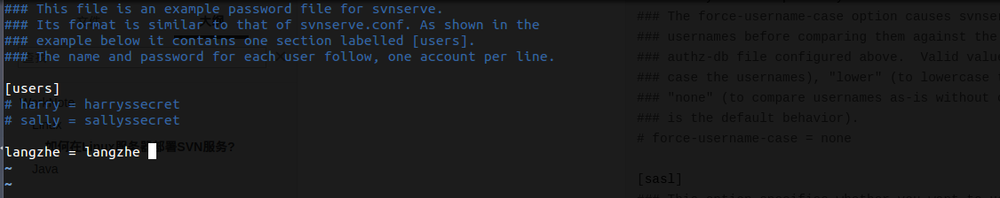

**9.配置访问权限文件**

```
vim authz
```

新建研发分组DEV_GROUP并且为用户langzhe和DEV_GROUP组配置访问权限

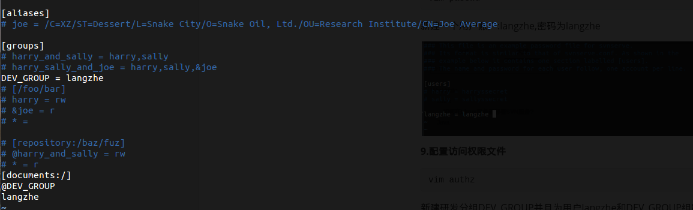

**10.修改svnserve的配置文件，指定版本库的路径**

```
vim /etc/sysconfig/svnserve
```

```
用来明确-r参数的确切仓库位置
```

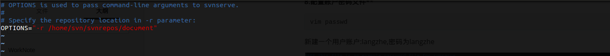

**11.启动svn服务**

```
svnserve -d -r /home/svn/svnrepos/document
```

**12.查看SVN服务状态是否正常**

```
ps -ef | grep svn
```

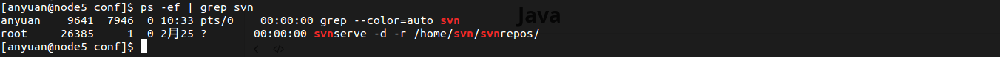

```shell
ps
-e : 显示所有进程
-f : 全格式输出
-a : 显示所有进程
-u : by effective user ID (supports names)
-x : processes w/o controlling ttys 
```

```
netstat -antpl | grep svnserve
```

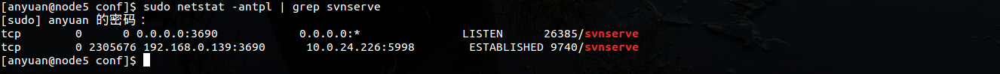

```shell
netstat常见参数
-a或--all：显示所有选项，默认不显示LISTEN相关
-t或--tcp：仅显示tcp相关选项
-u或--udp：仅显示udp相关选项
-n或--numeric：直接使用ip地址，而不通过域名服务器（拒绝显示别名，能显示数字的全部转化成数字）
-l或--listening：仅列出有在 Listen (监听) 的服務状态
-p或--programs：显示建立相关链接的程序名
-r或--route：显示路由信息，路由表
-e或--extend：显示扩展信息，例如uid等
-s或--statistice：显示网络工作信息统计表（按各个协议进行统计）
-c或--continuous：每隔一个固定时间，执行该netstat命令。
提示：LISTEN和LISTENING的状态只有用-a或者-l才能看到
```

**13.确认服务无误后,访问通过客户端访问SVN服务**

```
svn://ip地址/documents
```


### 基于docker部署Linux开发环境

------

***notice:本次部署软件版本仅针对具体项目使用,本文档仅提供单机安装操作命令支撑,具体集群服务部署以及相关配置不包含在本文档范围***

***部署清单***

| 安装软件 | 版本      |
| -------- | --------- |
| 操作系统 | Centos7.5 |
| Mysql    | 5.7       |
| Redis    | 3.2       |
| Nginx    | 1.0       |
| RabbitMQ | 3.7.15    |


#### Docker环境安装

**1.添加yum源**

```shell
sudo yum-config-manager --add-repo https://download.docker.com/linux/centos/docker-ce.repo
```

**2.查看版本库**

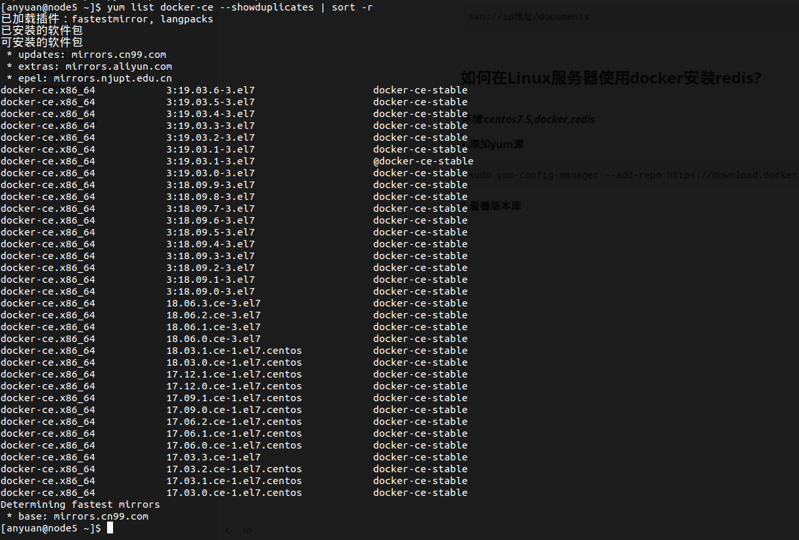

**3.安装docker**

```shell
sudo yum install docker-ce
```

**4.启动docker**

```shell
 sudo systemctl start docker
```

**5.开启开机自动启动**

```shell
sudo systemctl enable docker
```

**6.查看docker版本,是否安装成功**

```shell
docker version
```

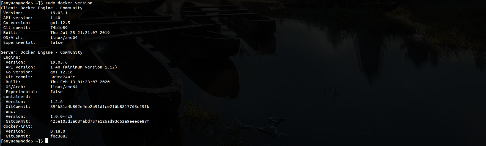


#### Mysql安装

**1.下载MySQL镜像**

```shell
docker pull mysql:5.7
```

**2.使用docker命令启动**

```shell
  docker run -p 3306:3306 --name mysql \
  -v /mydata/mysql/log:/var/log/mysql \
  -v /mydata/mysql/data:/var/lib/mysql \
  -v /mydata/mysql/conf:/etc/mysql \
  -e MYSQL_ROOT_PASSWORD=root  \
  -d mysql:5.7
```

***参数说明:***

```shell
-p 3306:3306：将容器的3306端口映射到主机的3306端口
-v /mydata/mysql/conf:/etc/mysql：将配置文件夹挂在到主机
-v /mydata/mysql/log:/var/log/mysql：将日志文件夹挂载到主机
-v /mydata/mysql/data:/var/lib/mysql/：将数据文件夹挂载到主机
-e MYSQL_ROOT_PASSWORD=root：初始化root用户的密码
```

**3.进入运行MySQL的容器**

```shell
docker exec -it mysql /bin/bash
```

**4.使用mysql命令打开客户端**

```shell
mysql -uroot -proot --default-character-set=utf8
```

**5.创建数据库**

```shell
create database mall character set utf8
```

**6.安装上传下载文件插件，并将mall.sql文件上传到Linux服务器上**

```shell
yum -y install lrzsz
```

**7.将mall.sql文件拷贝到mysql容器的/目录下**

```shell
docker cp mydata/mall.sql mysql:/
```

**8.将sql文件导入到数据库**

```
use mall;
source /mall.sql;
```

**9.创建一个anyuan帐号并修改权限，使得任何ip都能访问**

```
grant all privileges on *.* to 'anyuan' @'%' identified by 'saas';
```


#### Redis安装

**1.下载redis3.2镜像**

```shell
docker pull redis:3.2
```

**2.使用docker命令启动**

```shell
docker run -p 6379:6379 --name redis \
-v /mydata/redis/data:/data \
-d redis:3.2 redis-server --appendonly yes
```

**3.进入redis容器使用redis-cli命令进行连接**

```shell
docker exec -it redis redis-cli
```


#### Nginx安装

**1.下载nginx1.0的镜像**

```shell
docker pull nginx:1.10
```

**2.先运行一次容器（为了拷贝配置文件）**

```shell
docker run -p 80:80 --name nginx \
-v /mydata/nginx/html:/usr/share/nginx/html \
-v /mydata/nginx/logs:/var/log/nginx  \
-d nginx:1.10
```

**3.将容器内的配置文件拷贝到指定目录**

```shell
docker container cp nginx:/etc/nginx /mydata/nginx/
```

**4.修改文件名称**

```shell
mv nginx conf
```

**5.终止并删除容器**

```shell
docker stop nginx
docker rm nginx
```

**6.使用docker命令启动**

```shell
docker run -p 80:80 --name nginx \
-v /mydata/nginx/html:/usr/share/nginx/html \
-v /mydata/nginx/logs:/var/log/nginx  \
-v /mydata/nginx/conf:/etc/nginx \
-d nginx:1.10
```


#### RabbitMQ安装

**1.下载rabbitmq3.7.15的docker镜像**

```shell
docker pull rabbitmq:3.7.15
```

**2.使用docker命令启动**

```shell
docker run -d --name rabbitmq \
--publish 5671:5671 --publish 5672:5672 --publish 4369:4369 \
--publish 25672:25672 --publish 15671:15671 --publish 15672:15672 \
rabbitmq:3.7.15
```

**3.进入容器并开启管理功能**

```shell
docker exec -it rabbitmq /bin/bash
rabbitmq-plugins enable rabbitmq_management
```

**4.开启防火墙**

```shell
firewall-cmd --zone=public --add-port=15672/tcp --permanent
firewall-cmd --reload
```

**5.访问地址查看是否安装成功：http://localhost:15672/**

默认用户名密码:guest/guest


## Linux命令

### **netstat**

```shell
netstat常见参数
-a或--all：显示所有选项，默认不显示LISTEN相关
-t或--tcp：仅显示tcp相关选项
-u或--udp：仅显示udp相关选项
-n或--numeric：直接使用ip地址，而不通过域名服务器（拒绝显示别名，能显示数字的全部转化成数字）
-l或--listening：仅列出有在 Listen (监听) 的服務状态
-p或--programs：显示建立相关链接的程序名
-r或--route：显示路由信息，路由表
-e或--extend：显示扩展信息，例如uid等
-s或--statistice：显示网络工作信息统计表（按各个协议进行统计）
-c或--continuous：每隔一个固定时间，执行该netstat命令。
提示：LISTEN和LISTENING的状态只有用-a或者-l才能看到
```

***用例:查看redis端口服务***

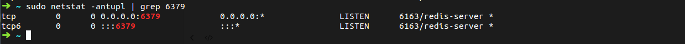

### ps 

```shell
ps
-e : 显示所有进程
-f : 全格式输出
-a : 显示所有进程
-u : by effective user ID (supports names)
-x : processes w/o controlling ttys 
```

***用例:查看Java或者tomcat相关进程***

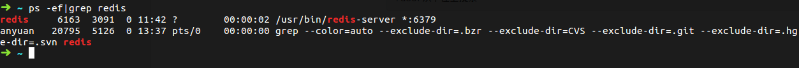

### vim

#### **1.vim查找搜索关键词?**

```shell
vim打开文档,命令模式下，输入/加上需要搜索的关键词.例如查找"user"字符串,直接在命令模式下:
/user
按小写字母n键查找下一个匹配项
按大写字母N键查找上一个匹配项
?user从下往上搜索
```


### &

Linux/Unix下一般如果想让某个程序在后台运行，很多都是使用&在程序结尾来让程序自动运行的。比如我们想要让mysql运行在后台：

```shell
/usr/local/mysql/bin/mysqld_safe --user=mysql &
```


### nohup

　但是我们很多程序并不象mysqld一样可以做成守护进程，可能我们的程序只是普通程序而已，一般这种程序即使使用 & 结尾，如果终端关闭，那么程序也会被关闭。为了能够后台运行，我们需要使用nohup这个命令，比如我们有个start.sh需要在后台运行，并且希望在后台能够一直运行，那么就使用nohup

```shell
nohup /root/start.sh & 1
```

在shell中回车后提示：

```shell
[~]$ appending output to nohup.out 1
```

原程序的的标准输出被自动改向到当前目录下的nohup.out文件，起到了log的作用。

***注意*：**当shell中提示了nohup成功后还需要按终端上键盘任意键退回到shell输入命令窗口，然后通过在shell中输入exit来退出终端.如果每次在nohup执行成功后直接点关闭程序按钮关闭终端,这时候会断掉该命令所对应得到session，导致nohup对应的进程被通知需要一起shutdown。 


### docker

#### **1.列出所有容器**

```shell
docker ps 
  -a :显示所有的容器，包括未运行的。
  -f :根据条件过滤显示的内容。
  --format :指定返回值的模板文件。
  -l :显示最近创建的容器。
  -n :列出最近创建的n个容器。
  --no-trunc :不截断输出。
  -q :静默模式，只显示容器编号。
  -s :显示总的文件大小。
```

#### 2.列出所有镜像

```shell 
docker images
```

#### 3.删除镜像或者删除容器

```shell
docker rm + 容器id
```

```shell
docker rmi + 镜像id
```

#### 4.在运行的容器中执行命令

```shell 
docker exec
  -d :分离模式: 在后台运行
  -i :即使没有附加也保持STDIN 打开
  -t :分配一个伪终端
```

***实例:在容器 elasticsearch 中开启一个交互模式的终端***

```shell
 docker exec -it elasticsearch /bin/bash
```

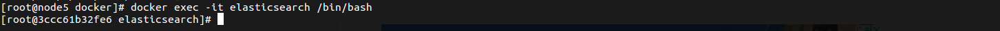


## Java开发日志

### SpirngBoot项目框架

#### 1.技术栈介绍

| 技术栈            | 版本号        |
| ----------------- | ------------- |
| SpringBoot        | 2.2.4.RELEASE |
| Mybatis Generator | 1.3.3         |
| Druid             | 1.1.10        |
| PagerHelper       | 1.2.10        |
| Swagger-UI        | 2.7.0         |

#### **2.技术点介绍**

##### Swagger-UI

```html
Swagger-UI是HTML, Javascript, CSS的一个集合，可以动态地根据注解生成在线API文档。
```

**常用注解**

- @Api：用于修饰Controller类，生成Controller相关文档信息
- @ApiOperation：用于修饰Controller类中的方法，生成接口方法相关文档信息
- @ApiParam：用于修饰接口中的参数，生成接口参数相关文档信息
- @ApiModelProperty：用于修饰实体类的属性，当实体类是请求参数或返回结果时，直接生成相关文档信息

***整合Swagger-UI***

**1.添加项目依赖**

```xml
<!--Swagger-UI API文档生产工具-->
<dependency>
  <groupId>io.springfox</groupId>
  <artifactId>springfox-swagger2</artifactId>
  <version>2.7.0</version>
</dependency>
<dependency>
  <groupId>io.springfox</groupId>
  <artifactId>springfox-swagger-ui</artifactId>
  <version>2.7.0</version>
</dependency>
```

**2.添加Swagger-UI的配置**

***注意：Swagger对生成API文档的范围有三种不同的选择***

- 生成指定包下面的类的API文档
- 生成有指定注解的类的API文档
- 生成有指定注解的方法的API文档

```Java
/**
 * Swagger2API文档的配置
 */
@Configuration
@EnableSwagger2
public class Swagger2Config {
    @Bean
    public Docket createRestApi(){
        return new Docket(DocumentationType.SWAGGER_2)
                .apiInfo(apiInfo())
                .select()
                //为当前包下controller生成API文档
              .apis(RequestHandlerSelectors.basePackage("com.macro.mall.tiny.controller"))
                //为有@Api注解的Controller生成API文档
                //.apis(RequestHandlerSelectors.withClassAnnotation(Api.class))
                //为有@ApiOperation注解的方法生成API文档                     		                           //.apis(RequestHandlerSelectors.withMethodAnnotation(ApiOperation.class))
                .paths(PathSelectors.any())
                .build();
    }

    private ApiInfo apiInfo() {
        return new ApiInfoBuilder()
                .title("SwaggerUI演示")
                .description("mall-tiny")
                .contact("macro")
                .version("1.0")
                .build();
    }
}

```


**3.Controller添加Swagger注解**

```Java
/**
 * 品牌管理Controller
 * Created by macro on 2019/4/19.
 */
@Api(tags = "PmsBrandController", description = "商品品牌管理")
@Controller
@RequestMapping("/brand")
public class PmsBrandController {
    @Autowired
    private PmsBrandService brandService;

    private static final Logger LOGGER =LoggerFactory.getLogger(PmsBrandController.class);

    @ApiOperation("获取所有品牌列表")
    @RequestMapping(value = "listAll", method = RequestMethod.GET)
    @ResponseBody
    public CommonResult<List<PmsBrand>> getBrandList() {
        return CommonResult.success(brandService.listAllBrand());
    }

```


**4.运行项目,访问Swagger-UI接口文档地址**

接口地址：http://localhost:8080/swagger-ui.html


------


#### 笔记

##### **1.@Configuration注解**

##### **2.@PropertySource注解**

##### **3.@primary注解**

##### **4.@Qualifier注解**

##### 5.session和token的区别

##### 6.@Mapper注解和@Repository注解


